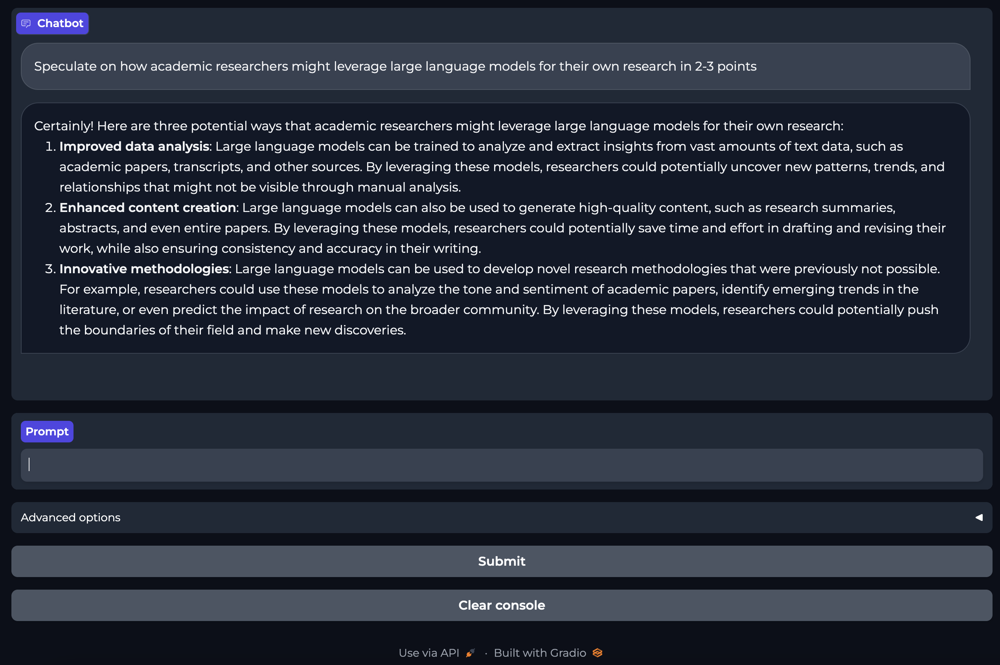

<h1> 
Centralized provisioning of 
 
large language models
for a research community
 
 
HPC User Support Tools (HUST23)
</h1>

Supplement for an accepted short paper in [HUST23][hust], "Centralized
provisioning of large language models for a research community," an [SC23][sc]
workshop. [DOI: 10.1145/3624062.3624147][doi].

This repository provides instructions, scripts, and example notebooks for
recreating the centralized-HPC LLM efforts of the authors.

## Installation steps

Our production environment exists on Arizona State University's flagship
supercomputer, [Sol][sol], which has a Rocky Linux 8 operating system. However,
reproduction should only depend on having the `mamba` (or with a simple
subsitution, `conda`) python package manager.

The shell script, `INSTALL_PYTHON_ENV.sh`, may be run to create a `mamba`
environment called `genai` that mirrors our own. The `mamba export env`
specification file `genai23.09-mamba-environment.yml` is provided for
completeness, but IS NOT recommended to rebuild from (due to over-specification
and build-order fragilities). Once the environment is created, create an
appropriate Jupyter kernel. An example is provided in the subdirectory
`example-jupyter-kernel`. In summary:

1. Install `mamba`, the python package manager and only dependency.
2. Run the `INSTALL_PYTHON_ENV.sh` shell script.
3. Create a Jupyter Kernel.
4. Installation is complete, now run the example notebooks!

## Example notebooks

The subdirectory, `example-notebooks`, contains two generalized templated
Jupyter notebooks that have been shared with Research faculty to get them
started with LLMs on the Sol supercomputer.

## GPU Config

The subdirectory, `gpu-config/`, provides details on the GPU configuration
necessary to replicate the presented results. For additional hardware details,
see our short paper on the [Sol supercomputer][sol].

## Gradio example image

LLM interaction may be empowered by [gradio][gradio], which provides a
temporary *public* web app for a chat-like LLM interface. This is illustrated
in the screenshot below.

[hust]: https://hust-workshop.github.io
[sc]: https://sc23.supercomputing.org
[doi]: https://doi.org/10.1145/3624062.3624147
[sol]: https://doi.org/10.1145/3569951.3597573
[gradio]: https://www.gradio.app

